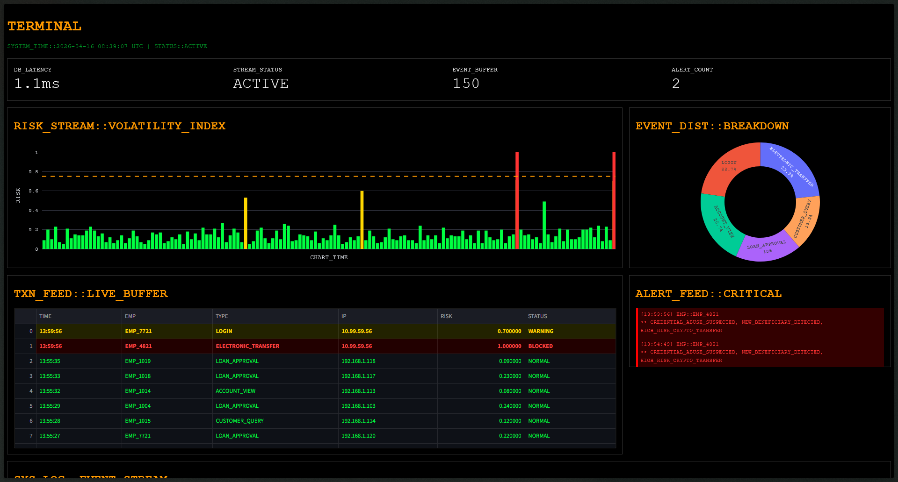
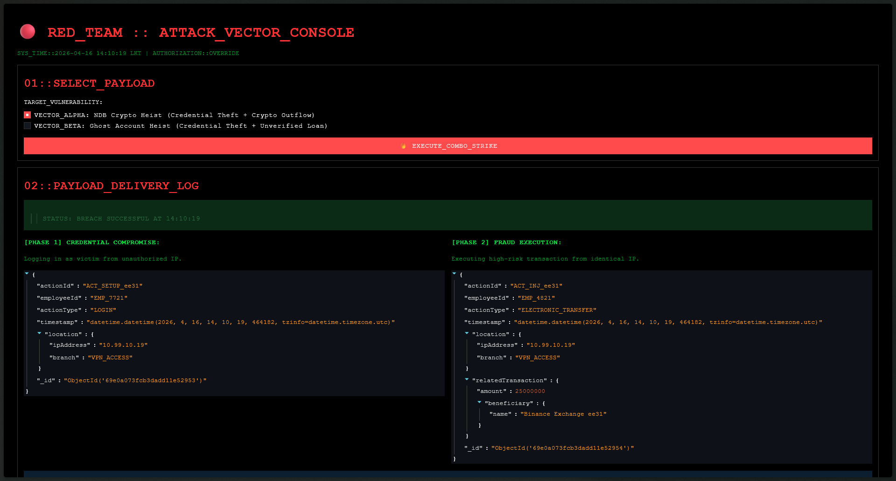

# 🛡️ SYS.TERMINAL // NDB Insider Threat Operations Center

## 📖 The Problem: The "Needle in a Haystack"
Modern financial institutions process thousands of transactions per minute. Traditional relational databases and static rule sets fail to catch complex, multi-step insider threats in real-time. 

In the infamous **NDB Rs. 13.2 Billion Heist**, attackers utilized a combination of **credential theft**, **unverified ghost accounts**, and **after-hours crypto transfers**. By the time the standard auditing systems flagged the anomaly, the money was gone. Furthermore, Central Bank of Sri Lanka (CBSL) mandates require critical breaches to be reported within 2 hours.

## 🚀 The Solution
This project is an **Enterprise-Grade NoSQL Anomaly Engine** and **Live SOC Terminal**. Instead of relying on static daily audits, it uses a live data-streaming architecture to evaluate employee actions on the fly. 

By analyzing the *context* of a transaction (Time, IP Address, Historical Behavior, and Beneficiary Novelty), the NoSQL engine instantly scores the risk of an action. It filters out natural network "noise" and instantly flags high-risk combo-attacks.

---

## 🏗️ System Architecture

This project is divided into three distinct operational domains:

### 1. The World Engine (generator.py & live_pumper.py)
* **generator.py**: The World Builder. Wipes the MongoDB database and generates a highly realistic bank environment with employees, KYC-verified customers, and historical baseline data.
* **live_pumper.py**: The Time Motor. Simulates live, high-frequency banking traffic. It generates natural network "jitter" (fluctuating between 0.05 and 0.40 risk scores) by processing loans, transfers, and logins in real-time.

### 2. The Command Center (src/terminal.py)
A Bloomberg-style, dark-mode Security Operations dashboard.
* **Real-Time Volatility Chart**: Plots live risk scores chronologically.
* **Live Feed**: Streams NoSQL transactions, utilizing color-coded CSS to instantly highlight WARNING (Yellow) and BLOCKED (Red) events.
* **Alert Feed**: Extracts the specific anomaly flags generated by the rules engine for CBSL compliance reporting.

### 3. The Red Team Injector (src/injector.py)
A separate, offensive cybersecurity console used to execute combination strikes against the live database.
* Injects **Phase 1 (Setup)**: Unauthorized credential access.
* Injects **Phase 2 (Strike)**: Massive financial outflow to unverified crypto exchanges or shell companies.

---

## ⚙️ The Scoring Engine (src/engine/rules.py)
The engine utilizes a dynamic thresholding model. Standard transactions float at a base score of ~0.1. Penalties are compounded based on anomaly combinations:
* `+0.6`: Credential Abuse / Impossible Travel (Same IP, Multiple Accounts)
* `+0.4`: New / Unverified Beneficiary (e.g., Unregistered Crypto Exchange)
* `+0.5`: Ghost Account Flag (Bypassing KYC Verification)
* `+0.3`: After-Hours Operations

**Alert Threshold:** Any transaction scoring `>= 0.75` is instantly blocked and triggers a CBSL Critical Alert.

---

## 🎬 How to Run the Live Simulation (Viva Guide)

To properly demonstrate the real-time capabilities of this system, you must run it across three separate terminal windows.

### Step 1: Initialize the Environment
Open **Terminal 1** and build the database:
`> python generator.py`

Wait for the success message, then start the live data stream:
`> python live_pumper.py`
*(Leave this running in the background).*

### Step 2: Launch the SOC Monitor
Open **Terminal 2** and start the Bloomberg Terminal:
`> streamlit run src/terminal.py --server.port 8501`

### Step 3: Launch the Red Team Console
Open **Terminal 3** and start the attack injector:
`> streamlit run src/injector.py --server.port 8502`

### The Demonstration:
1. Show the examiner the **SOC Terminal**. Explain the natural jitter and the baseline risk hovering in the green zone.
2. Move to the **Red Team Console**. Explain the combo payload (Credential Theft + Crypto Transfer).
3. Click **EXECUTE COMBO STRIKE**.
4. Immediately switch back to the **SOC Terminal** to watch the NoSQL engine instantly catch the combination attack, spike a 1.0 Red Alert, and isolate the compromised employee ID.

---
*Developed for Advanced Database Systems & Cybersecurity Defense.*